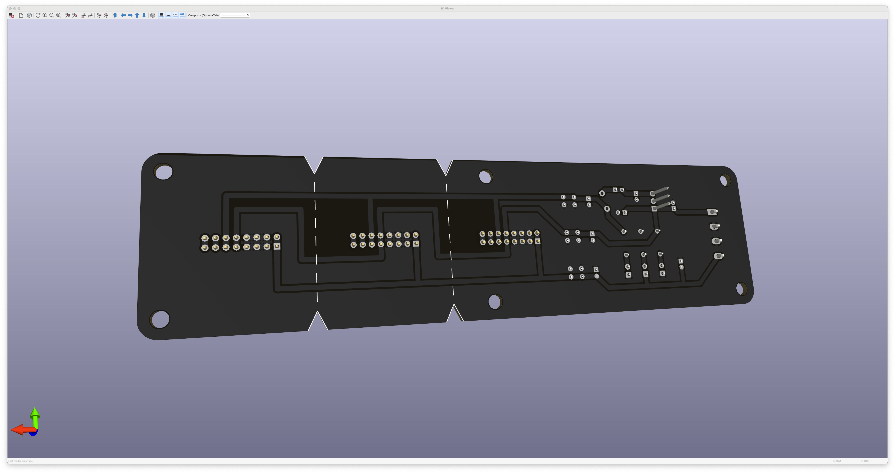

# EurorackPower

A(nother) power distribution board, mainly intended to learn about the PCB design an manufacturing process.

Here is the [BOM] with mouser references.

## Features

 * Using 1,4mm traces, enough to process 3A on 1oz PCB
 * Additional capacitors on board per power line to counter ripple and noise
 * Onboard jumper to normalize 0V to earth ground
 * Dashed silkscreen lines to safely cut the PCB if less than 3 rows/connectors are actually needed for the application
 * Open Source Hardware

## Images

## Additional Info

This open hardware project needs an external +12V, 0V, -12V power supply.

Please find the [Wiring] schematic for further details.

Watch the related [video] on Youtube for an in depth tutorial.

[BOM]: EurorackPowerBOM_2019-03-02.xlsx
[Wiring]: KiCad/Wiring/Wiring.pdf
[video]: https://youtu.be/7tzhh7atj4o